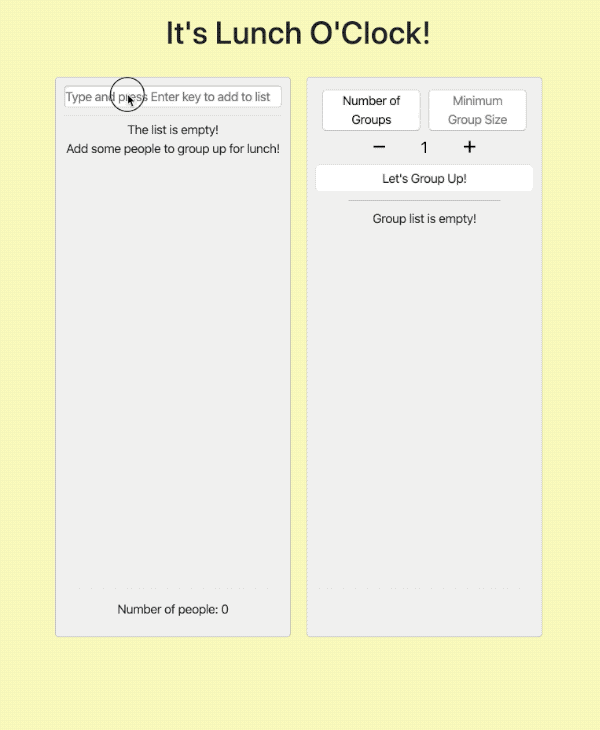
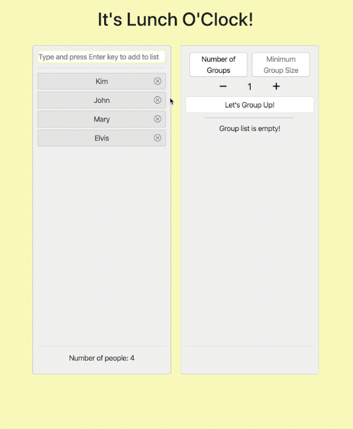

# Lunch O' Clock

Lunch O'Clock is an application that divides a list of people into groups for lunch.

## Preview

### Add People



### Create Group



## Installation

```
git clone https://github.com/imhojang/lunch-o-clock.git

cd lunch-o-clock

npm install

npm start (to start client)

node server/main.js (to start server)

```

## Tasks

- Shows current list of people
- Should be able to add or delete a person to the list

  - a person should only have one property: name
  - cannot add a person with duplicate name (not caps specific)

- Make random groups with options
  - Options
    - \# of groups
    - minimum size (of a group)
  - show error if you can't make groups

## Project Control

- Used Trello to follow through tasks on a daily basis
- Used Git as a version control system

---

## Challenges

### 1. Dividing people into groups by minimum group size and number of groups

### 2. Incorporating ESLint rules

### 3. Using PropTypes as a type checker

### 4. Writing unit tests for components

### 5. Using svg as icons

### 6. Whether to keep a local state to a component or add all state to redux store

### 7. Deciding on how small a component should be

### 8. Naming variables and class selectors

## Things to do

### 1. Additional component tests

### 2. Endpoint testing

### 3. Proper error handling in server endpoints
